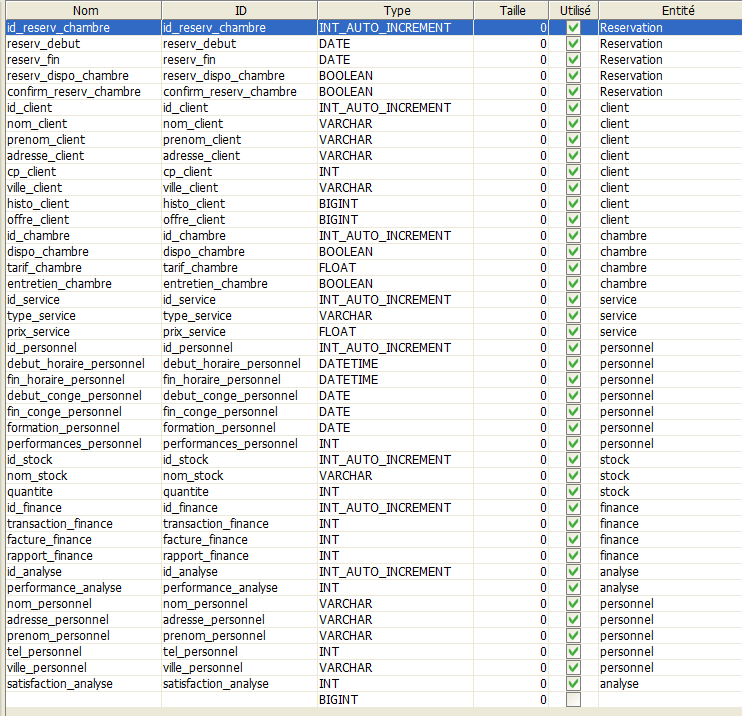
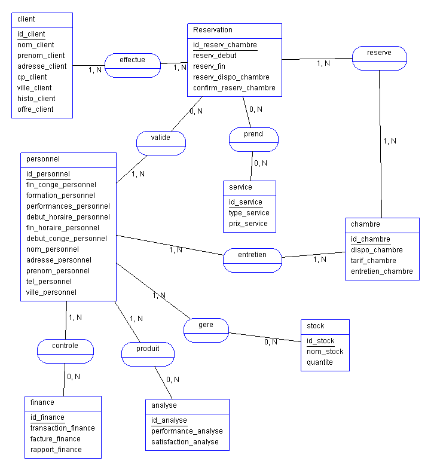
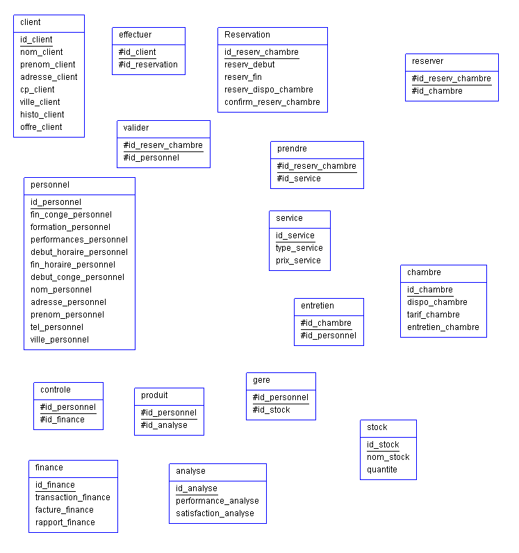
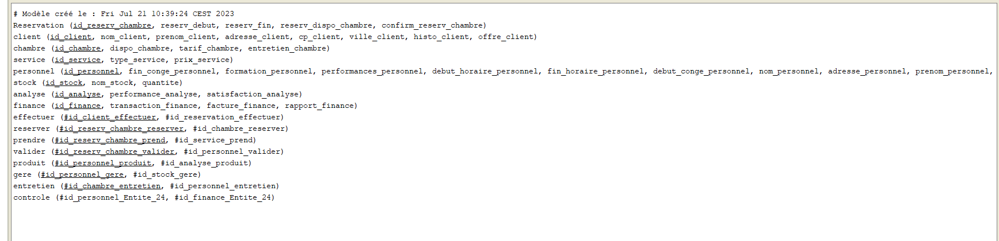

*****************
# NB:
 - Le dictionnaire n'est pas dans l'ordre dût à un ajout tardif.

 - Lors de la finalisation du markdown , j'ai constaté une inversion des images MLD et MPD, ne pas en tenir compte.

 - Un fichier SQL est présent dans le dossier, syntaxe MySQL.

 - Un fichier texte est présent dans le dossier, pour condenser les infos avant de les traiter.

 - Le fichier .asi est présent dans le dossier.

 - Explication dans le chapitre MCD de la démarche pensé de mon côté.

********************


# Dictionnaire

 
****************
# MCD
Pour le MCD , je part du principe que:

- 1 ou plusieurs clients peuvent effectué une ou plusieurs réservations
-1 ou plusieurs réservations peuvent être effectué par un client ( ou plusieurs )
****************
-une réservation concerne une ou pluseurs chambre
-une ou plusieurs chambres attribués a une ou plusieurs réservations
****************
-une chambre peut prendre 0 ou `n` services
-`n` service peut etre pris pas 0 ou plusieurs chambres
*****************
-le personnel peut valider une ou plusieurs réservations
- 0 ou plusieurs réservations peuvent être valider par le personnel
****************
-le personnel entretien 1 ou plusieurs chambres
- 1 ou plusieurs chambres peuvent être entretenue par 1 ou plusieurs personnel
*****************
- 1 ou plusieurs personnels peut gérer le stock
- 1 élément ou plusieurs du stock peuvent être géré par 1 ou plusieurs personnels
******************
- 1 ou plusieurs personnel peut produire des analyses
- 1 ou plusieurs analyses peuvent être produit par le personnel
*****************
- 1 ou plusieurs personnel peut contrôler les finances
- 1 ou plusieurs finances peuvent être controlé par le personnel

 
****************
# MLD

Toutes les relations deviennent des entités à part entière.



****************
# MPD

 
****************

# SQL

```sql
DROP TABLE IF EXISTS Reservation ;
CREATE TABLE Reservation (id_reserv_chambre INT AUTO_INCREMENT NOT NULL,
reserv_debut DATE,
reserv_fin DATE,
reserv_dispo_chambre BOOLEAN,
confirm_reserv_chambre BOOLEAN,
PRIMARY KEY (id_reserv_chambre)) ENGINE=InnoDB;

DROP TABLE IF EXISTS client ;
CREATE TABLE client (id_client INT AUTO_INCREMENT NOT NULL,
nom_client VARCHAR,
prenom_client VARCHAR,
adresse_client VARCHAR,
cp_client INT,
ville_client VARCHAR,
histo_client BIGINT,
offre_client BIGINT,
PRIMARY KEY (id_client)) ENGINE=InnoDB;

DROP TABLE IF EXISTS chambre ;
CREATE TABLE chambre (id_chambre INT AUTO_INCREMENT NOT NULL,
dispo_chambre BOOLEAN,
tarif_chambre FLOAT,
entretien_chambre BOOLEAN,
PRIMARY KEY (id_chambre)) ENGINE=InnoDB;

DROP TABLE IF EXISTS service ;
CREATE TABLE service (id_service INT AUTO_INCREMENT NOT NULL,
type_service VARCHAR,
prix_service FLOAT,
PRIMARY KEY (id_service)) ENGINE=InnoDB;

DROP TABLE IF EXISTS personnel ;
CREATE TABLE personnel (id_personnel INT AUTO_INCREMENT NOT NULL,
fin_conge_personnel DATE,
formation_personnel DATE,
performances_personnel INT,
debut_horaire_personnel DATETIME,
fin_horaire_personnel DATETIME,
debut_conge_personnel DATE,
nom_personnel VARCHAR,
adresse_personnel VARCHAR,
prenom_personnel VARCHAR,
tel_personnel INT,
ville_personnel VARCHAR,
PRIMARY KEY (id_personnel)) ENGINE=InnoDB;

DROP TABLE IF EXISTS stock ;
CREATE TABLE stock (id_stock INT AUTO_INCREMENT NOT NULL,
nom_stock VARCHAR,
quantite INT,
PRIMARY KEY (id_stock)) ENGINE=InnoDB;

DROP TABLE IF EXISTS analyse ;
CREATE TABLE analyse (id_analyse INT AUTO_INCREMENT NOT NULL,
performance_analyse INT,
satisfaction_analyse INT,
PRIMARY KEY (id_analyse)) ENGINE=InnoDB;

DROP TABLE IF EXISTS finance ;
CREATE TABLE finance (id_finance INT AUTO_INCREMENT NOT NULL,
transaction_finance INT,
facture_finance INT,
rapport_finance INT,
PRIMARY KEY (id_finance)) ENGINE=InnoDB;

DROP TABLE IF EXISTS effectuer ;
CREATE TABLE effectuer (#id_client_effectuer BIGINT AUTO_INCREMENT NOT NULL,
#id_reservation_effectuer BIGINT,
PRIMARY KEY (#id_client_effectuer)) ENGINE=InnoDB;

DROP TABLE IF EXISTS reserver ;
CREATE TABLE reserver (#id_reserv_chambre_reserver BIGINT AUTO_INCREMENT NOT NULL,
#id_chambre_reserver BIGINT,
PRIMARY KEY (#id_reserv_chambre_reserver)) ENGINE=InnoDB;

DROP TABLE IF EXISTS prendre ;
CREATE TABLE prendre (#id_reserv_chambre_prend BIGINT AUTO_INCREMENT NOT NULL,
#id_service_prend BIGINT,
PRIMARY KEY (#id_reserv_chambre_prend)) ENGINE=InnoDB;

DROP TABLE IF EXISTS valider ;
CREATE TABLE valider (#id_reserv_chambre_valider BIGINT AUTO_INCREMENT NOT NULL,
#id_personnel_valider BIGINT,
PRIMARY KEY (#id_reserv_chambre_valider)) ENGINE=InnoDB;

DROP TABLE IF EXISTS produit ;
CREATE TABLE produit (#id_personnel_produit BIGINT AUTO_INCREMENT NOT NULL,
#id_analyse_produit BIGINT,
PRIMARY KEY (#id_personnel_produit)) ENGINE=InnoDB;

DROP TABLE IF EXISTS gere ;
CREATE TABLE gere (#id_personnel_gere BIGINT AUTO_INCREMENT NOT NULL,
#id_stock_gere BIGINT,
PRIMARY KEY (#id_personnel_gere)) ENGINE=InnoDB;

DROP TABLE IF EXISTS entretien ;
CREATE TABLE entretien (#id_chambre_entretien BIGINT AUTO_INCREMENT NOT NULL,
#id_personnel_entretien BIGINT,
PRIMARY KEY (#id_chambre_entretien)) ENGINE=InnoDB;

DROP TABLE IF EXISTS controle ;
CREATE TABLE controle (#id_personnel_Entite 24 BIGINT AUTO_INCREMENT NOT NULL,
#id_finance_Entite 24 BIGINT,
PRIMARY KEY (#id_personnel_Entite_24)) ENGINE=InnoDB;

```

**********************************